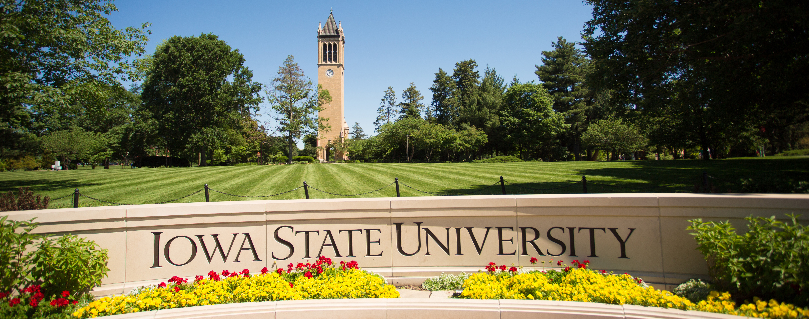

# Spring 2024 ESCIP Workshop: "Teaching scientific computing at the dawn of AI"

:::{admonition} **ESCIP worksop at Iowa State University May 30-31, 2024**

- Please mark your calendars for an upcoming in-person ESCIP workshop that will be held at Iowa State University in Ames IA (located 35 miles from DSM airport) on May. 30-31, 2024.
- The central theme of workshop is about strategies of teaching scientific computing at the time where ChatGPT and similiar disruptive generative AI technologies are changing the way we do research and process information.  
- This event will be a combination writing retreat (instructors work on course materials) plus training program (faculty learn new skills and discuss best practices for teaching Python in undergraduate science courses). 
- Research Corporation for Science Advancement (RCSA) will be sponsoring the workshop and providing meals for all attendees. Registration is free but you must RSVP to reserve a spot! Workshop organizer may be able to help offset hotel lodging costs for faculty, but we need to know if you will need this scholarship. 
- If these activities interest you and fit into your schedule, **please fill out the [registration form](https://forms.gle/HbCYMA9KCphwH9Jd8) by April 1, 2024** to receive more information.
:::

## Tentative schedule

### Wednesday May 29, 2024:

|    Time         |   Activity   |
| :------------   | -------------: |
| Step 1     |  Arrive at Des moines Airport, can take a [convenient shuttle](https://www.executiveexpress.biz/shuttle-service/) (sign up a week before to reserve) to Ames or use Uber/Lyft|
| Step 2     |  Arrive at [Gateway Hotel of Ames](https://www.gatewayames.com/?gad_source=1&gclid=CjwKCAiAivGuBhBEEiwAWiFmYd_bDL2ZwiJL24UCD7-JF8ZD6-vSqDUP6vmgmWIXBR79M8Nu1fIwgBoCoKcQAvD_BwE&gclsrc=aw.ds) on campus of ISU |
| 6 pm - 7 pm     |  Welcome Social and Dinner        |
| 7 pm - 8 pm     | Opening |

### Thursday May 30, 2024:

|    Time         |   Activity   |
| :------------   | -------------: |
|8 am - 9 am | Breakfast and Tour of MolSSI resources (https://molssi.org/education/) |
|9 am - 10 am | Discussion of Python resources for undergraduate science education |
|10 am - 12 pm | Work on Python teaching materials in small groups (or attend MolSSI workshop) |
|12 pm - 1 pm | Lunch and informal discussions |
|1 pm - 4 pm | Work on Python teaching materials individually or in small groups |
|4 pm - 5 pm | Keynote Talk  |
|5 pm - 6 pm | Dinner and lightning talks, sharing by attendees |
|6 pm - 7 pm | Education talk  |
|7 pm –  | informal discussions |

### Friday May 31, 2024:

|    Time         |   Activity   |
| :------------   | -------------: |
| 8 am - 9 am | Breakfast and Tour of ESCIP repository (escip.github.io) |
| 9 am - 11 am | Work on Python teaching materials in small groups (or attend MolSSI workshop) |
| 11 am - 12 pm | Attendees report out and complete end-of-workshop survey |
| 12 pm - 1 pm | Lunch and informal discussions |
| 3 pm - 6 pm | Tour of Des Moines Capitol and East Village |
